# Invora architecture and design review

Date: 6 October 2026 · Status: approved with revisions; implementation started

> **Approved revisions (6 October 2026):** .NET 10; one business per database with multiple branches; Phase 1 and Phase 2 form one delivery scope; complete inventory/money correction handling is mandatory; PDFsharp/MigraDoc replaces QuestPDF as the free MIT-licensed PDF choice; the supplied invoice photograph is the layout reference. The sections below retain the original SaaS proposal for traceability. These revisions supersede all multi-tenant/shared-database, QuestPDF, phase deferral and implementation-stop statements below.

Current single-business database design does not use TenantId or ambient tenant filters. Branch authorization remains required. A singleton constraint prevents multiple businesses; future SaaS hosting may route to isolated databases only after an explicit security design. No unauthenticated caller may choose a database connection. Runtime and package versions are pinned in repository configuration.

## 1. Scope and decisions

Invora is a retail operating system for mobile/electronics stores. Its first release connects receiving stock, individual IMEI lifecycle, billing, customer payments, invoice-linked LenDen, and owner reporting. A modular monolith, one PostgreSQL database, one ASP.NET API, and one Angular application keep transactions reliable and deployment affordable.

This document is the first deliverable requested in the supplied brief. No application implementation or initial migration is authorized at this stage. Future entities and routes below describe extension points; they will be introduced through their own reviewed migrations, not generated together in a speculative initial schema.

### Review decisions and architectural risks

| Decision / risk | Proposed treatment | Review needed |
|---|---|---|
| Requested .NET 8 is near end of support | Preserve the requested target in this proposal; recommend .NET 10 LTS before implementation. Never deploy an unsupported runtime | Confirm target framework |
| One database serves multiple tenants | Claim-derived context, tenant filters, composite foreign keys, write guards, branch policies, adversarial integration tests | Accept isolation model |
| Supplier ledger appears in Phase 2, but purchases need payable accounting in Phase 1 | Implement supplier ledger posting/allocation in Phase 1; defer rich ledger screens/reports | Accept minimum accounting scope |
| Cancellation/returns are phased later but immutable invoices need correction | Include safe cancellation and payment reversal in Phase 1; partial returns/credit-note UX in Phase 2. Pilot must have a supported correction path | Confirm pilot correction requirements |
| Two independent unique IMEI columns permit cross-column duplicates | A canonical InventoryIdentifier table owns all IMEI values with one tenant-wide uniqueness constraint | Accept canonical identity table |
| IMEI capture override can create untraceable stock | MVP requires identities before posting; later authorized exception puts units in quarantine, unavailable for sale | Confirm whether exception is needed initially |
| Quantity stock cost is unspecified | FIFO receipt layers with per-sale cost allocations; serialized stock uses unit cost | Confirm costing policy with accountant |
| Advances and refunds affect invoice due differently from account balance | Separate ledger entries and invoice allocations; customer credit does not silently erase an invoice due | Accept allocation semantics |
| E-invoice, bill-of-supply, place-of-supply and used-device tax rules | Configurable tax policies; accountant validates pilot configuration. No official filing/IRN claims | Validate actual business tax regime |
| PDF library licensing | QuestPDF behind IInvoicePdfService, subject to commercial eligibility check | Confirm license before adding dependency |
| No sample invoice was attached | Use the requested detailed A4 structure; approve a rendered fixture before pilot | Supply/reference sample later if desired |
| Single Lightsail host is a failure domain | Off-host encrypted backups, tested restoration, measured capacity and recovery targets | Accept pilot availability tradeoff |
| Offline financial transactions risk duplicate stock sales | PWA shell only initially; all posting requires online authorization | Accept online-first transactions |
| Registration identity scope | Tenant-bound users in MVP; business handle + login identify tenant before authentication | Confirm multi-business account needs |
| Default currency versus GST | INR financial posting in MVP; configuration is future-ready, no unimplemented FX support | Accept MVP currency scope |

Microsoft lists .NET 8 support ending on **10 November 2026** and .NET 10 LTS support through **14 November 2028**. [Official support policy](https://dotnet.microsoft.com/en-us/platform/support/policy).

Angular's current compatibility table lists **Angular 22.0.x**, TypeScript **6.0.x**, and supported Node ranges including **24.15.0+ within Node 24**. Pin compatible stable patch versions and Angular Material's matching major when the skeleton is created; do not use floating latest tags. [Official compatibility table](https://angular.dev/reference/versions).

QuestPDF is source-available software with license eligibility requirements. The proposal does not assume a commercial SaaS qualifies for its free license. [Official pricing and licensing](https://www.questpdf.com/pricing.html).

## 2. System, containers and modules

### System context

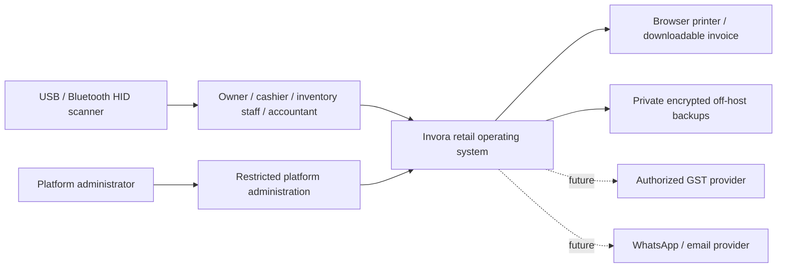

### Container and deployment diagram

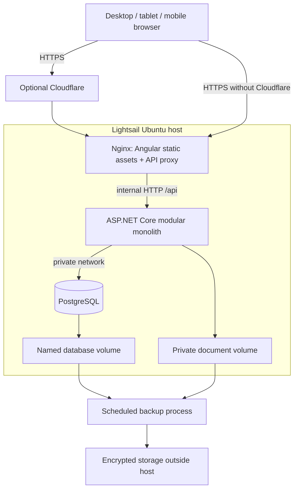

### Business module relationships

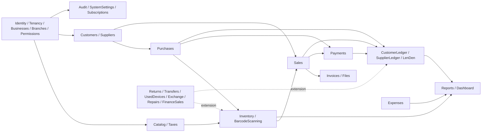

Modules own their entities and use cases. Cross-module workflows coordinate directly in-process through narrow application interfaces and one DbContext transaction. No message broker, microservice split, generic repository wrapper, mandatory mediator, or distributed transaction. No module owns a second copy of financial truth.

| Module group | Responsibilities / boundaries |
|---|---|
| Identity, Tenancy, Businesses, Branches, Users, Permissions | Authenticated context, onboarding, tenant lifecycle, branch membership, authorization |
| Catalog, Taxes | Brands, models, variants, tenant tax configuration; historical documents retain snapshots |
| Inventory, BarcodeScanning | Unit identity, receipt layers, stock movements, reservations, scanner normalization and lookup |
| Suppliers, Purchases, SupplierLedger | Supplier master, draft receiving, atomic purchase posting, supplier payables |
| Customers, Sales, Payments, CustomerLedger, LenDen | Customer master, atomic billing, receipts, allocations, account balance and invoice due |
| Invoices, Files | Immutable invoice snapshot, private documents, render/download; provider integrations isolated |
| Expenses, Reports, Dashboard | Operational expenses and permission-filtered read projections |
| Audit, Subscriptions, SystemSettings | Durable business audit, entitlement checks, tenant settings |
| Returns, StockTransfers, UsedDevices, DeviceExchange | Phase 2 stock and financial corrections / acquisitions |
| Repairs, FinanceSales, Notifications, ImportExport | Later workflows; providers do not mutate completed documents directly |

## 3. Final folder structure and backend dependencies

The following is the planned final structure; only documentation is created now.

```text
Invora/
├── Invora.sln
├── global.json
├── Directory.Build.props
├── Directory.Packages.props
├── .editorconfig
├── .gitignore
├── .env.example
├── README.md
├── src/
│   ├── Invora.Domain/
│   │   ├── Common/                  # Entity, value objects, domain errors
│   │   └── Modules/{Capability}/    # Entities, enums, domain rules
│   ├── Invora.Application/
│   │   ├── Abstractions/            # Current context, persistence, clock, providers
│   │   ├── Common/                  # Result, validation, authorization
│   │   └── Modules/{Capability}/
│   │       ├── Commands/{UseCase}/
│   │       ├── Queries/{UseCase}/
│   │       └── Policies/
│   ├── Invora.Contracts/
│   │   ├── Common/                  # Pagination, error codes
│   │   └── Modules/{Capability}/    # Request/response contracts
│   ├── Invora.Infrastructure/
│   │   ├── Persistence/{Configurations,Migrations,Interceptors}/
│   │   ├── Identity/
│   │   ├── Modules/{Capability}/
│   │   ├── Files/
│   │   ├── Pdf/
│   │   └── BackgroundJobs/
│   └── Invora.Api/
│       ├── Modules/{Capability}/    # Thin endpoints
│       ├── Middleware/
│       ├── Authorization/
│       ├── Configuration/
│       ├── Program.cs
│       ├── appsettings.json
│       └── appsettings.Development.json
├── tests/
│   ├── Invora.UnitTests/Modules/
│   └── Invora.IntegrationTests/{Fixtures,Modules,Security}/
├── invora-web/
│   ├── src/app/
│   │   ├── core/{auth,api,context,errors,layout}/
│   │   ├── shared/{scanner,components,directives,formatting}/
│   │   └── features/{auth,setup,dashboard,sales,inventory,purchases,
│   │                    customers,lenden,suppliers,expenses,reports,settings}/
│   ├── src/styles/
│   ├── public/
│   └── e2e/
├── deploy/
│   ├── api/Dockerfile
│   ├── web/Dockerfile
│   ├── nginx/
│   └── scripts/{backup,restore,deploy}/
├── docker-compose.yml
├── docker-compose.dev.yml
├── .github/workflows/
└── docs/
    ├── design-review.md
    ├── architecture.md
    ├── database.md
    ├── api.md
    ├── multi-tenancy.md
    ├── inventory.md
    ├── lenden.md
    ├── invoice.md
    ├── scanner.md
    ├── security.md
    ├── deployment.md
    └── backup-restore.md
```

Capabilities are the named modules in section 2; create folders only when a feature actually exists. Scanner browser code belongs in shared/scanner; server inventory lookup belongs to Inventory. LenDen queries reuse customer accounting.

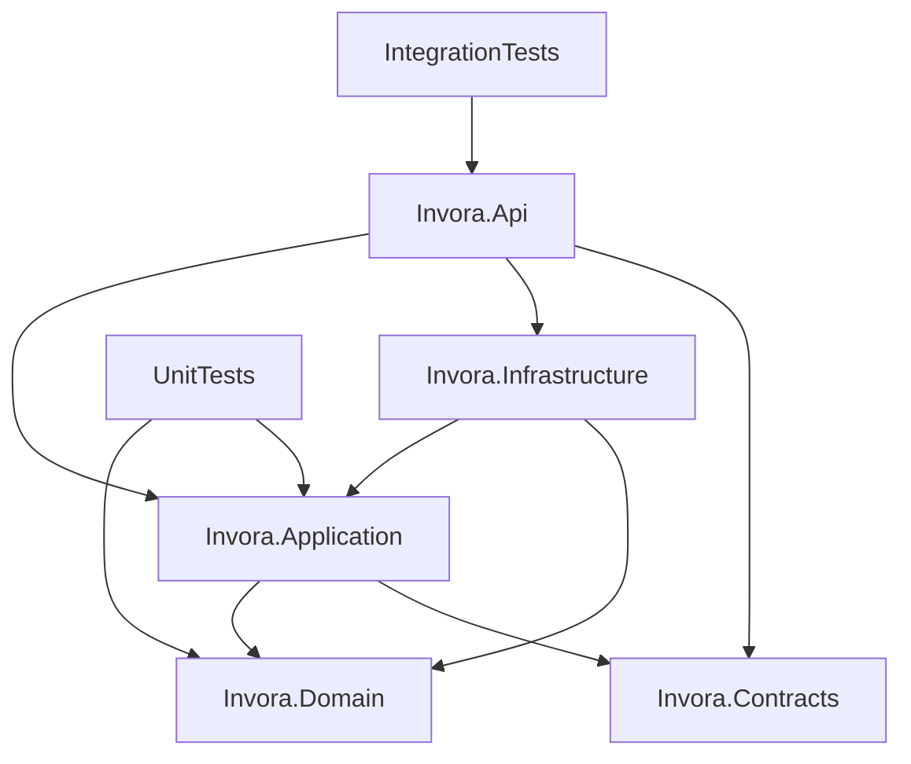

Arrows mean compile-time references. Domain has no EF, HTTP, PDF or JWT dependencies. Contracts has no domain/infrastructure dependency. Application owns `IInvoraDbContext` exposing necessary entity sets and transaction operations; EF/Npgsql implementation lives in Infrastructure. Application may use EF query extensions through EF Core abstractions where useful, but never provider-specific configuration. No repository is added solely to rename DbContext methods.

Use nullable C#, async I/O with CancellationToken, FluentValidation, explicit domain transitions, structured Result errors for expected failures, and global exception mapping for unexpected failures. API maps contracts to use cases, validates identity and policies, and returns results; it does not calculate balances or taxes. Serilog, Swagger/OpenAPI, ProblemDetails and health checks are standard host facilities. Infrastructure uses ASP.NET Identity, Npgsql EF Core and QuestPDF after licensing review. Match EF/Npgsql major versions to the approved runtime and lock dependencies.

## 4. Frontend architecture and navigation

Angular standalone components, lazy feature routes, strict TypeScript, typed Reactive Forms, RxJS for API/scan streams, signals for local view state, and Angular Material establish the baseline. No global state library until shared-state complexity warrants one. One generated/typed API boundary avoids endpoint duplication. Guards and permission directives improve UX; server policies remain authoritative.

Root shell: tenant/business name, authorized branch switcher, persistent global search, New Sale action, task-oriented navigation and session menu. Feature facades own draft state. An interceptor adds the in-memory access token and correlation ID, handles one coordinated refresh request, and never blindly retries non-idempotent mutations. On branch switch, warn about unsaved drafts and refresh scoped data; never move a draft to a new branch silently.

| Navigation | Routes / principal screen behavior |
|---|---|
| Authentication | `/login`, `/register`, `/forgot-password`, `/reset-password`; business handle, credentials and session errors |
| Setup | `/setup/business`, `/setup/branch`, `/setup/owner`, `/setup/taxes`, `/setup/bank`; resumable onboarding, completion gate |
| Dashboard | `/dashboard`; business-day sales, gross profit if authorized, receipts, dues and stock |
| Sales | `/sales`, `/sales/new`, `/sales/:id`; scanner-first billing, draft, completion, print, correction actions |
| Inventory | `/inventory`, `/inventory/add`, `/inventory/scan`, `/inventory/:id`; IMEI lifecycle, quantity stock, movements |
| Purchases | `/purchases`, `/purchases/new`, `/purchases/:id`; supplier invoice, item lines, 13/20 scanned counter |
| Customers | `/customers`, `/customers/new`, `/customers/:id`; Overview, Purchases, Payments, Ledger, Notes tabs |
| LenDen | `/lenden`, `/lenden/overdue`, `/lenden/customer/:id`; invoice-linked due, payment allocation and notes |
| Suppliers | `/suppliers`, `/suppliers/:id`; master and purchase/payable summary; detailed ledger Phase 2 |
| Expenses | `/expenses`; entry, categories, receipt, reversal |
| Reports | `/reports`; sales, payments, GST/HSN, outstanding, stock, authorized profit |
| Settings | `/settings/business`, `/settings/tax`, `/settings/bank`, `/settings/invoice`, `/settings/users`, `/settings/branches`, `/settings/permissions`, `/settings/subscription` |
| Phase 2 | `/inventory/aging`, `/transfers`, `/returns`, `/used-devices`, `/exchanges`, imports/exports |
| Phase 3 | `/repairs`, `/repairs/new`, `/repairs/:id`, `/finance`; customer Finance/Returns/Repairs tabs appear when implemented |

Sales desktop layout: wide scanner/search and item grid, customer panel, totals and mixed-payment panel, explicit Complete Sale button. Mobile uses stacked panels and a sticky total/action. Customer detail prominently shows outstanding and last payment, then linked invoices with product/IMEI and receipt history. Inventory uses server-side pagination and filters; cost columns are omitted from unauthorized responses as well as UI.

Keyboard operations, visible focus, accessible error text, live scan status, large touch targets, locale-aware INR formatting and screen-reader labels are acceptance criteria. Do not put future features in navigation as fake working screens. PWA architecture initially caches only static shell assets, never financial API responses or offline posting queues.

## 5. Data conventions and complete entity catalog

Every business-specific table has `TenantId`; branch-specific tables also have `BranchId`. UUID IDs are internal. Global tables are explicitly limited to Permission, SubscriptionPlan and platform administrative identities/audit. Tenant-owned tables use unique `(TenantId, Id)` keys so composite foreign keys enforce ownership. BusinessProfile is one-to-one with Tenant. `TenantId` is never accepted as authoritative from business request bodies.

All persisted monetary amounts use `numeric(18,2)` / C# decimal. Unit prices and costs also use two decimals in MVP; intermediate calculations use decimal precision before explicit rounding. Rates use `numeric(7,4)` and quantity `numeric(18,3)` with integer-only validation for pieces/serialized units. No JS floating-point calculation is authoritative: API money is decimal strings, frontend decimal helpers provide estimates, server returns final reconciled amounts. UTC instants use timestamptz; commercial dates use date with tenant timezone and financial-year rules captured at posting. FinancialYearStartMonth defaults to April but is configurable. IDs do not determine posting order.

Every mutable aggregate has CreatedAtUtc, UpdatedAtUtc and an optimistic Version. Archived masters remain referenced; posted financial documents, ledger and movement records are append-only. Corrections point to originals. Financial foreign keys use Restrict/NoAction. Draft child removal may be explicit; no cascading deletion through posted history.

| Module | Entities and essential data | Phase |
|---|---|---|
| Tenancy / Businesses | Tenant: handle, status, settings/version; BusinessProfile: trade/legal name, business type, owner/contact, GSTIN/PAN, full address/state/code, country, website, logos/signature/stamp, INR/timezone/FY start, prefixes/payment terms/jurisdiction/declaration, GST/composition/provider flags, default bank FK; BusinessBankAccount: bank/name/holder/account/IFSC/branch/UPI/default/active | 1 |
| Branches | Branch: code/name/address/state/GST registration override if required, active flag; UserBranch: authorized membership | 1 |
| Identity | User: tenant-bound Identity credentials, active/security stamp; Role; UserRole; RolePermission; RefreshToken: family/hash/expiry/revoked/replacement; UserInvitation: hashed token/expiry | 1 |
| Permissions | Permission: global stable code; role definitions tenant-owned; no user-supplied claims grant privileges | 1 |
| Settings | TenantSettings: scanner/tax/display policies and version; DocumentSequence: branch/type/FY/series/counter; IdempotencyRecord: key/user/route/hash/result/expiry | 1 |
| Taxes | TaxRate: name, aggregate/components/cess, active; TaxPolicy configuration version with tax-inclusive and invoice eligibility rules | 1 |
| Catalog | Brand; ProductCategory; ProductModel: brand/category/description/default HSN/tax/warranty; ProductVariant: model/RAM/storage/color/SKU/barcode/MRP/selling price/serialized/IMEI/serial flags/unit | 1 |
| Suppliers | Supplier: contact/legal/address/GST/PAN/credit terms/limit/notes/active | 1 |
| Customers | Customer: contact/name/address/GST/type/credit limit/active; CustomerNote: author/date/text; outstanding cache optional and rebuildable | 1 |
| Purchases | Purchase: supplier/branch/numbers/dates/status/totals/snapshots; PurchaseItem: variant/quantity/cost/discount/tax/charges; PurchaseItemUnit: captured draft identifiers pending posting | 1 |
| Inventory | InventoryUnit: variant/branch/cost/additional/effective cost/MRP/prices/status/condition/source/receipt/supplier/purchase refs; InventoryIdentifier: kind/slot/normalized value/unit FK; InventoryReservation: draft sale/expiry/units or quantities | 1 |
| Quantity stock | StockBalance: branch/variant/on hand/reserved/version; StockCostLayer: receipt quantity/remaining/unit landed cost/source; StockCostAllocation: sale or return quantity consumed/restored by layer | 1 |
| Stock audit | InventoryMovement: unit optional/variant/branch/type/signed quantity/actor/UTC/reference; explicit purchase/sale/transfer/return/adjustment FKs as applicable | 1 |
| Sales | Sale: customer/branch/date/due/salesperson/status/totals/payment projection; SaleItem: variant/unit optional/snapshots/quantity/price/tax/cost/profit/warranty dates | 1 |
| Payments | PaymentTransaction: party/branch/type/direction/positive amount/date/method/references/notes/reversal links; SalePaymentAllocation; PurchasePaymentAllocation; PaymentAllocationReversal | 1 |
| Ledger | CustomerLedgerEntry: sale/payment/credit/debit/opening/adjustment refs, debit/credit/posting sequence/date/actor; SupplierLedgerEntry: purchase/payment/correction equivalents; LedgerAdjustment: reason/approval/source | 1 |
| Invoices | Invoice: sale or credit-note ref/type/series/number/status/issue date; InvoiceSnapshot: immutable versioned seller/buyer/bank/terms snapshot; InvoiceLineSnapshot; InvoiceTaxSummary; InvoiceArtifact: render version/storage key/hash; EInvoiceRecord: provider-origin IRN/ack/signed QR/status | 1, provider later |
| Expenses | ExpenseCategory; Expense: branch/category/amount/date/method/vendor/description/reversal refs; attachments private | 1 |
| Audit / files | AuditLog: tenant/branch/actor/action/entity/redacted before/after/reason/network/correlation/time; DocumentAttachment: storage/mime/hash/name/size/actor/status; AttachmentLink: entity link with ownership validation | 1 |
| Subscriptions | SubscriptionPlan: global feature/limits; TenantSubscription: Trial/Active/PastDue/Suspended/Cancelled, period/limits; UsageCounter for atomic enforced limits | 1 minimal |
| Returns | SaleReturn; SaleReturnItem: original line/unit/quantity/disposition/refund decision; CreditNote; CreditNoteItem; PurchaseReturn; PurchaseReturnItem; SupplierCreditNote | 2 |
| Transfers / adjustments | StockTransfer; StockTransferItem; StockTransferReceipt; StockAdjustment; StockAdjustmentItem: reasons/approvals/count variances | 2; controlled opening/adjustment minimum 1 |
| Used / exchange | UsedPhoneInspection: acquisition/customer/condition checklist/repair costs/warranty/photos via attachments; DeviceAcquisition: purchase from customer/payment refs; DeviceExchange: new sale/acquired unit/value/links | 2 |
| Finance | FinanceProvider; FinanceSale: contract/down payment/provider receivable/fee/settlement; FinanceSettlementAllocation; FinanceLedgerEntry | 3 |
| Repairs | RepairJob: customer/device/problem/condition/accessories/cost/status/technician/dates; RepairJobEvent; RepairPartUsage; RepairPaymentAllocation | 3 |
| Notifications / jobs | NotificationDelivery: provider/template/reference/status; BackgroundJob: durable retry/lease/reference/error; provider credentials external to table | 3; durable PDF jobs only if needed earlier |
| Import/export | ImportJob; ImportRowError; ExportJob: tenant/branch/permission/output/review status; no unreviewed financial overwrite | 2 |
| Platform | PlatformAdminUser, PlatformAuditLog: global control-plane records with explicit target tenant, separate authorization; usage/health only by default | later |

ASP.NET Identity standard claim/login/token support tables are infrastructure details rather than separate business aggregates. If external login is introduced, include their standard composite tenant ownership configuration. Feature APIs do not return refresh hashes, security stamps or authentication internals.

### Key cardinalities and additional rules

- Tenant owns one BusinessProfile and many branches, users, masters and financial records. Customers/suppliers/catalog are tenant-wide; a branch may only expose their financial history within the requesting user's branch scope.
- A variant selects serialized or quantity mode. Changing this mode after stock transactions is forbidden; create a new variant for a different mode.
- Each serialized SaleItem has quantity 1 and one InventoryUnit. Invoice display may group identical variants, but it must list every unit's IMEI1/IMEI2/serial. A unit can have many sale lines over its lifetime after legitimate returns; only one active sale assignment at a time.
- InventoryIdentifier is authoritative; IMEI1/IMEI2 in API models are projections by slot, not independent uniqueness authorities. Enforce `(TenantId, Kind, NormalizedValue)` unique permanently for device identities; resale reuses the same unit. If duplicate historic records exist, import to exception review without creating a second sellable identity.
- PurchaseItemUnit is draft capture. Posting validates its count and identifiers, then creates/reuses authorized stock records atomically. Override never silently bypasses sale identity requirements.
- Payments are many-to-many with invoices through allocations. A nullable convenience SaleId cannot represent all allocations and is not the source of due calculation.
- Attachments have one stored blob and validated links. Polymorphic entity links cannot rely on ordinary foreign keys; authorize the target and attachment tenant explicitly. Critical financial links use concrete foreign keys, not only ReferenceType/ReferenceId strings.
- Default bank must belong to the same tenant. Invoice snapshots freeze its details; deactivation never changes issued invoices.

## 6. Full logical ERD

Diagrams are split for readability and together cover the catalog above. Every entity below except the explicitly global Permission, SubscriptionPlan and platform records is tenant-owned. Branch-specific entities also carry BranchId, including child records where required to enforce branch constraints. Common columns are omitted from drawings. Snapshot components are stored relationally; address/terms/checklists may be versioned JSONB owned values. These are logical designs, not a migration.

### Foundation

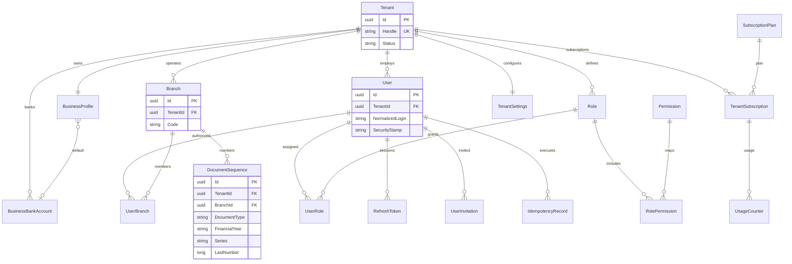

Registration creates tenant/profile/first branch/owner/membership/roles/subscription in one transaction. Global plan/permission definitions are seeded deterministically.

### Catalog, receiving and stock

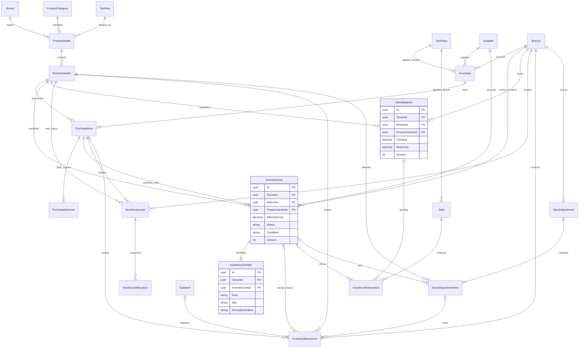

### Billing, payment, LenDen and invoices

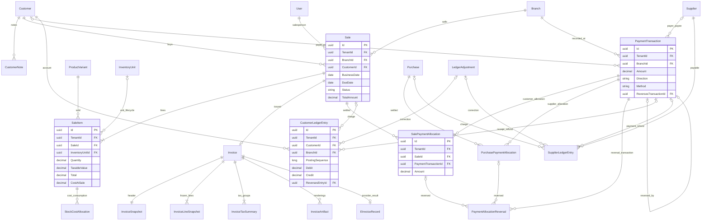

### Corrections, transfers, used devices and finance

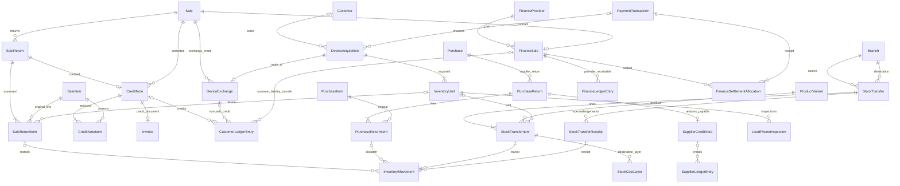

### Operations and supporting records

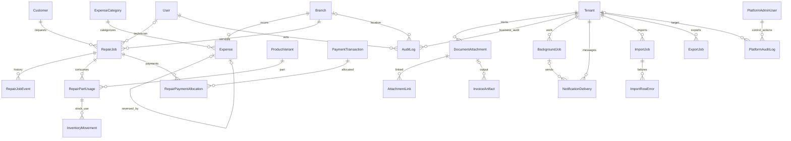

ERD FK attributes shown nullable in the prose are optional even if field drawings do not display null markers. Enforce exactly one allocation target on PaymentAllocationReversal and exactly one source on ledger/movement records where appropriate. Logical graphs omit repetitive tenant and actor edges; ownership remains mandatory in SQL.

## 7. Multi-tenancy and branch isolation

Shared database/shared schema is appropriate for the initial scale. `ICurrentUser` exposes verified UserId, Roles and effective Permissions; `ICurrentTenant` exposes TenantId and timezone/status; `ITenantContext` combines tenant/user/authorized branch IDs/selected branch. Context is scoped, immutable after resolution, and fail-closed when unavailable.

Business handle is only an unauthenticated login lookup hint. Credentials must resolve to that tenant's user; a client cannot gain tenant access by changing the handle. JWT signature, issuer, audience, expiry and security/session version are verified before tenant claims become context. Business requests reject or ignore payload TenantId and server-assign ownership. BranchId inputs are explicit resource selections and must pass active membership checks every time.

EF global filters constrain tenant rows and archived masters. Branch filters apply to branch-scoped data according to authorized scope. A request may select one authorized branch or an explicitly authorized all-branch view; a missing branch never means all branches. Use cases recheck sensitive resource ownership, state and active tenant/user/branch. SaveChanges guards reject tenant mutation, unauthorized branch assignment and cross-tenant tracked entities. Composite FK constraints close gaps left by application bugs.

Raw SQL and set-based updates include tenant and branch predicates explicitly. `IgnoreQueryFilters` is prohibited in normal business code. Background work opens an explicit tenant scope from a validated durable job and has no ambient unscoped access. Platform administration uses separate endpoints/policies and does not inherit a bypass role into business requests.

PostgreSQL RLS can add defense in depth, but is deferred until transaction-local context and pool reset semantics are tested. Do not claim EF filters alone provide database-level isolation. If RLS is enabled, runtime role must not own tables or have BYPASSRLS; default-deny policies and WITH CHECK are required. PostgreSQL documents the owner/bypass exceptions. [Official row-security documentation](https://www.postgresql.org/docs/current/ddl-rowsecurity.html).

Cross-branch receipts in MVP are limited to invoices in the selected branch. Owners can view consolidated balances; settling another branch's invoices requires an explicit authorized branch selection. Later central collections may introduce interbranch accounting, not silent branch reassignment. Tenant-wide customer totals are returned only to authorized consolidated viewers; restricted staff receive branch-scoped totals labeled accordingly.

## 8. Authentication, permissions and subscription enforcement

Use tenant-bound ASP.NET Identity users with secure password hashing, lockout, normalized logins and security stamps. Owner registration creates tenant/profile/branch/roles/subscription atomically, then issues credentials only after commit. Email/phone verification and password-reset delivery need a real provider for production; no fake reset success flow. Owner invites staff using short-lived single-use hashed tokens. MFA for owner/platform accounts is a production hardening goal.

Access JWT lifetime: proposed 10 minutes. Store it in browser memory. Refresh token: opaque cryptographically random value, hash only in database, proposed 14-day lifetime, HttpOnly Secure SameSite cookie scoped to auth endpoints. Rotate on every refresh; lock token record, reject replay and revoke its family. Log out revokes session/family and clears cookie. Password reset, disabled user and privilege changes invalidate security version. Permission checks resolve current grants with request-scoped caching, not long-lived JWT permission lists. No localStorage token persistence.

Same-origin Nginx routing is default. Verify Origin and apply anti-CSRF tokens for cookie-authenticated refresh/logout; cross-origin deployments use exact CORS allowlist and deliberate cookie settings. Rate-limit login, reset, refresh and registration by IP plus normalized account without revealing account existence. Never log tokens/passwords.

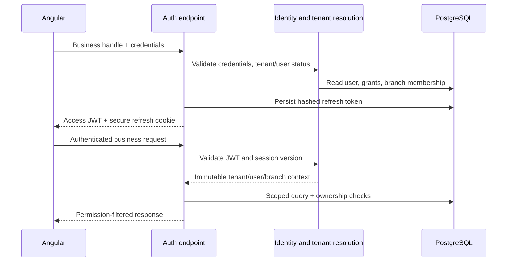

| Role template | Default capabilities |
|---|---|
| Owner | All tenant business controls and cost/profit, authorized branches; cannot bypass immutability |
| Admin | Staff/settings/operations, cost/profit configurable; no platform privileges |
| Manager | Branch operations, capped discounts/overrides and reports as granted |
| Salesperson | Sales creation, customer quick-create, stock retail lookup, receive permitted payments; no costs/profit |
| Accountant | Ledgers/payments/expenses/reports and authorized reversal; stock operational actions separate |
| InventoryStaff | Catalog lookup, receiving and stock management; sales/financial visibility separate |
| Technician | Repair workflows when implemented, minimal customer/device information |

Initial codes include `inventory.view`, `inventory.cost.view`, `inventory.create`, `inventory.adjust`, `inventory.transfer`, `sales.view`, `sales.create`, `sales.discount`, `sales.cancel`, `sales.return`, `customers.view`, `customers.manage`, `customers.credit.view`, `payments.view`, `payments.create`, `payments.reverse`, `purchase.view`, `purchase.create`, `supplier.view`, `supplier.manage`, `expenses.view`, `expenses.create`, `expenses.reverse`, `profit.view`, `reports.view`, `reports.export`, `users.manage`, `branches.manage`, `business.settings`, `subscription.manage`, `audit.view`, `files.upload`, `ledger.adjust`, and `branches.all.view`.

Policies combine permission + tenant + branch + resource state + field restrictions. Discount caps and sensitive reason/approval requirements are policy parameters. API projections remove costs, margin, supplier unit costs and consolidated cash position for unauthorized callers. Separate policies apply to PDF/download/export/report/search, preventing indirect leakage. Prevent removal of the last active owner.

Trial/Active allow entitled actions; PastDue has explicit grace policy; Suspended/Cancelled deny normal mutations but preserve authorized read/export/recovery access according to policy. Limits for branches/users/invoices are checked atomically; no payment gateway in MVP. Platform admins may inspect tenant lifecycle and health without accessing financial records. Any later support access is explicit, time-limited and audited.

## 9. Inventory and costing design

Serialized products use one InventoryUnit per physical device. IMEI is text preserving leading zeros; normal input requires 15 ASCII digits. Optional Luhn policy must distinguish format errors from audited historical exceptions. Dual IMEIs are two identifiers of one unit, not two devices. Serial/barcode normalization is type-aware; never strip meaningful serial characters. EAN/UPC check-digit validation can be type-specific. Product barcode identifies a variant; device identity identifies a unit.

Tenant-wide permanent IMEI uniqueness protects both slots. Serial uniqueness is enforced when configured, with namespace rules reviewed for manufacturer reuse; product barcode uniqueness is tenant-wide among active variants. Identifier lookup returns authorized branch, availability and retail price; sold-invoice details are shown only to users with sales permission. A duplicate check in UI improves feedback, but only database uniqueness closes concurrency races.

| Transition | Allowed cause / invariant |
|---|---|
| New receipt → InStock | Completed purchase/opening/acquisition, valid identity and cost |
| InStock → Reserved | Authorized draft, expiry, exclusive reservation |
| Reserved → InStock | Expiry/release/cancel; atomic release |
| InStock or own Reserved → Sold | Sale posting, conditional state update; one active sale assignment |
| Sold → Returned → InStock / Damaged / InRepair | Authorized return/cancellation with physical disposition; original sale retained |
| InStock → InTransit → InStock at destination | Transfer dispatch/receipt, source and destination movements |
| InStock → InRepair → InStock / Damaged | Repair workflow with audit |
| InStock → Lost / WrittenOff / Damaged | Approved adjustment/reason and valuation impact |

`Transferred` is a historical transfer event, not a permanently unsellable terminal state. Destination receipt restores availability with the new branch. Units flagged quarantined for missing identity are excluded from sale regardless of count override. No negative stock.

Quantity products use StockBalance and immutable signed InventoryMovement. Available = OnHand − active Reserved. Completion conditionally decrements balance only when sufficient stock exists. Serialized movement quantity is ±1; a reservation is not a physical movement. Receipt-to-sale movement reconciliation must match balance and unit status.

FIFO quantity valuation uses StockCostLayer and StockCostAllocation, locking layers deterministically by received timestamp and ID. Purchase landed cost allocates additional charges consistently by pre-tax item value (fallback quantity for zero-value lines), with final-line remainder adjustment; it reconciles exactly. Recoverable input taxes are excluded from cost only under the configured accountant-approved eligibility rule. Nonrecoverable taxes/charges are included. Transfers carry cost layers unchanged; returns restore original allocated cost. Serialized CostAtSale snapshots EffectiveCost. Profit = net selling value excluding tax − cost consumed; expenses separately produce an estimated operating profit, not statutory accounts.

## 10. Scanner architecture

`ScannerInputService` normalizes input and coordinates a component-owned queue. `<invora-scanner-input>` has target type, terminator (Enter default, Tab optional), rapid mode, expected count and enabled state. It emits a scan event; it does not itself post a purchase or sale. Scope input capture to the active screen/dialog, never a global listener that steals normal typing.

HID workflow: explicit Scan action focuses input → receive characters → terminator → trim/type-aware normalize → local validation and duplicate detection → enqueue → server lookup/validation → show accepted/error → clear/refocus if the same scanner context remains active. Timing heuristics may improve feedback but must not reject manual input or slow Bluetooth hardware. Do not buffer passwords or unrelated inputs.

Rapid scans are processed in order with draft-session duplicate sets and bounded queues, not canceled by RxJS switchMap. Network failure preserves pending values for explicit retry without repeated add effects. Focus is restored only after scanner-owned work; a quick-customer modal suspends scanning and restores the previous context on close. Accessible status and sound after user interaction; sound is optional and no sole success signal.

Purchases count physical units, not IMEI strings: scanning IMEI2 attaches to the selected unit so 20 dual-SIM phones require 20 units, not 40. Validate exact unit count, mandatory identifiers and server uniqueness before finalizing. Sales scan by identifier; accessories add quantities by barcode; repeated unit scan is rejected. Backend completion repeats all checks.

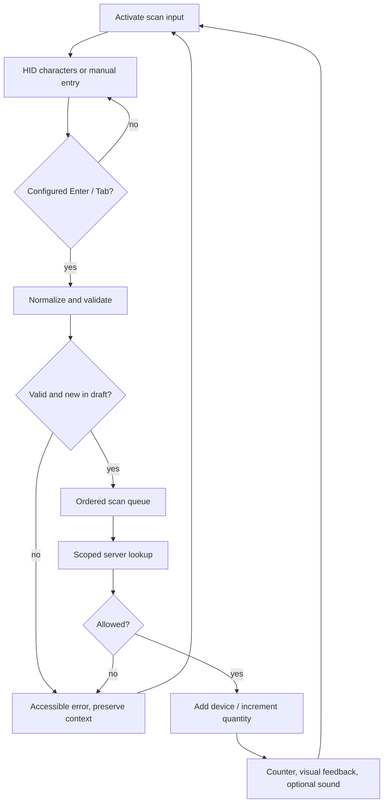

Camera later implements `IScanSource` and produces the same normalized events using BarcodeDetector/ZXing as supported. No vendor SDK or driver installation is required for HID.

## 11. Purchase workflow and transaction

Draft captures supplier/invoice reference, branch, business dates, product lines, unit costs/tax/charges, private attachments and serialized identifiers. Server recalculates totals. Duplicate supplier document warning uses normalized supplier invoice number + supplier + financial year; enforce uniqueness when business numbering convention is confirmed. Validate supplier/variant/tax active, branch authorized, quantities positive and captured units complete.

Posting creates stock/identifiers, cost layers, receiving movements, supplier payable credit, optional supplier outgoing payments and allocations, document number, audit and status in one transaction. Payments debiting supplier ledger reduce payable. Draft deletion is allowed before posting with audit; completed purchases require return/credit correction, not edited prices.

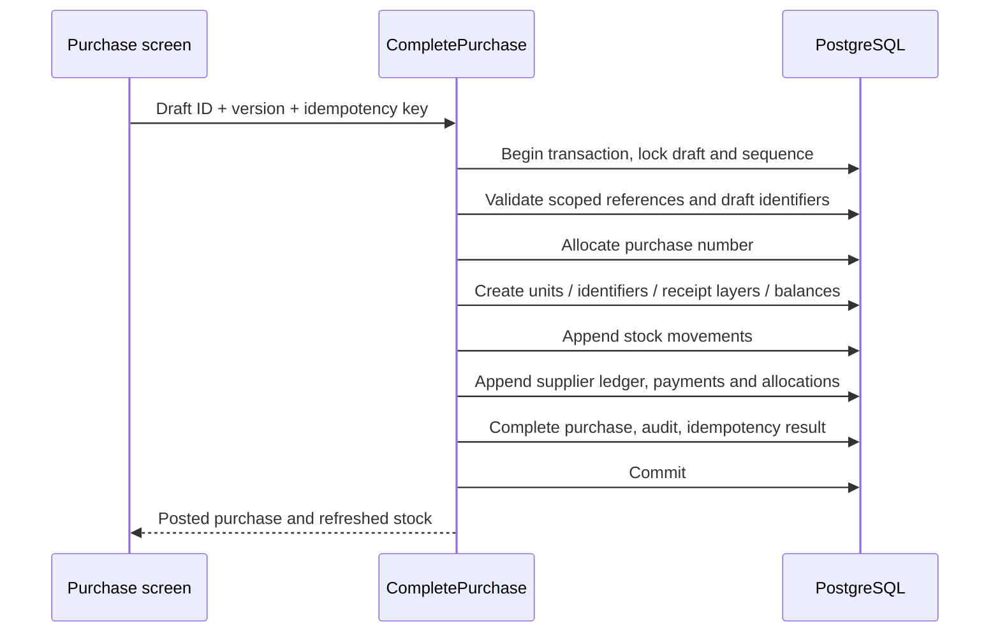

## 12. Sales workflow and transaction

Scan stock, select/quick-create customer, enter price/authorized discount, select tax/place of supply, due date/terms and payment components. Quote totals come from server calculation. Credit requires customer identity and credit permission/limit checks; a named walk-in customer may be used for fully paid retail only with a documented policy. Zero-item sales, invalid discounts, inactive branches and unavailable stock fail before completion.

One serialized line per unit simplifies lifecycle and cost. Completion locks draft/customer credit state, sequence, inventory and quantity layers in deterministic order. Conditional updates enforce availability. Payment components each create a separate PaymentTransaction (Cash/UPI/Card/etc.); Mixed is an aggregate UI label, not a method that obscures receipts. Finance is a receivable agreement later, not cash received.

Commit sale/items, immutable invoice snapshot/number, sold units, movement/cost consumption, sale debit, initial payment credits/allocations, audit, sequence, idempotency record and any projections together. PDF rendering occurs after commit and can retry; render failure must not roll back or duplicate an otherwise completed sale. No provider calls inside stock locks.

```mermaid
sequenceDiagram
  participant UI as Billing screen
  participant UC as CompleteSale
  participant DB as PostgreSQL
  participant PDF as Invoice renderer
  UI->>UC: Draft ID + version + payment components + key
  UC->>DB: Begin; lock draft, customer, stock, sequence
  UC->>DB: Recalculate tax, validate branch/credit/availability
  UC->>DB: Allocate number and snapshot invoice
  UC->>DB: Sell units / consume quantities and cost
  UC->>DB: Append sale debit, payment credits and allocations
  UC->>DB: Append movements and audit; complete draft
  UC->>DB: Save idempotency result; commit
  UC-->>UI: Completed sale and invoice ID
  UI->>PDF: Download / print invoice
  PDF->>DB: Load authorized immutable snapshot
  PDF-->>UI: A4 PDF or retryable render failure
```

## 13. LenDen, ledger and payment allocation

CustomerLedgerEntry is an append-only party subledger. Customer outstanding = sum(Debit − Credit) over posted entries in authorized scope. Sales debit, received payments credit, refunds debit, credit notes credit, reversals append the inverse of the original entry. Negative account balance means customer credit and must be displayed separately from positive dues. Running balance uses stable EntryDate + PostingSequence + ID ordering; backdated entries do not silently alter persisted historical reports without their posting timestamp being visible.

Supplier payable = sum(Credit − Debit): purchase credits, supplier outgoing payments debit, supplier credit notes debit, refunds received credit. These are operational receivable/payable subledgers, not a complete double-entry general ledger; do not claim statutory balance sheet/accounting support. Every entry has a validated source and unique posting key. Ledger entries cannot be manually edited or deleted.

Invoice remaining due = original invoice total − posted credit notes affecting it − active invoice settlement allocations, bounded by consistent refund/correction rules. Cash received, account balance and invoice balance are different metrics. Allocation creates no second ledger credit: the payment itself already posted that credit. `AmountPaid`/`OutstandingAmount` are optional rebuildable projections. Cached values are never used as authoritative inputs for posting.

Each allocation belongs to the same tenant/customer/branch as the receipt and invoice in MVP. Payment amount positive; sum active allocations ≤ net unreversed payment; invoice allocations cannot exceed available due. Lock affected invoices/customer and payment to prevent concurrent over-allocation. Explicit user choice is default; optional FIFO targets oldest due date then sale date then ID, with preview. Opening balances use approved opening documents/adjustments with an explicit due item if invoice-level recovery is required; never invent an IMEI for historical debt.

Example: ₹30,000 sale debit; ₹10,000 receipt credit and allocation; ₹20,000 invoice/account due. Later ₹5,000 receipt/credit/allocation yields ₹15,000. A ₹3,000 unallocated advance reduces account due to ₹12,000 but leaves that invoice at ₹15,000 until an authorized allocation uses the advance. LenDen displays both figures and unallocated credit clearly.

LenDen row contains customer, original invoice/date/due date, product, every IMEI, total, initial paid, subsequent receipts, active allocated balance, latest payment and notes. Multi-item invoices show one invoice due with child devices; do not duplicate ₹15,000 across every IMEI and then sum it. Product-level payment allocation is unnecessary in MVP. Notes on every receipt and customer follow-up are attributed/timestamped; financial receipt notes are correction-audited.

Aging uses tenant business date and DueDate, not UTC midnight: current (due today or later), 1–7, 8–30, 31–60, 61–90 and 91+ overdue. This resolves the brief's overlapping “61–90 / 90+” labels. Missing due dates follow snapshotted payment terms or are shown as undated, never silently marked overdue.

```mermaid
sequenceDiagram
  participant UI as Receive payment
  participant UC as RecordCustomerPayment
  participant DB as PostgreSQL
  UI->>UC: Customer, amount, method, allocations, notes, key
  UC->>DB: Begin; lock customer, selected invoices and payment state
  UC->>DB: Validate ownership, active balances and amount
  UC->>DB: Insert receipt and customer ledger credit
  UC->>DB: Insert invoice allocations
  UC->>DB: Insert audit / receipt number / idempotency result
  UC->>DB: Commit
  UC-->>UI: Receipt, invoice due and customer balance
```

Future finance transfer posts customer account credit for provider-assumed liability and provider receivable debit only after confirmed contract acceptance. Customer down-payment due stays in customer ledger; lender EMI is not shop receivable. Provider settlement reduces finance receivable; fees/shortfall are explicit adjustments/expenses. Trade-in credit similarly uses a linked noncash acquisition/exchange posting, never fabricated cash receipts.

## 14. GST calculations and invoice model

TaxRate is configurable per tenant, not a hardcoded 18%. Capture HSN/SAC, effective rates, inclusive/exclusive mode, discounts and place of supply at posting. TaxPolicy validates component consistency. MVP handles configured ordinary domestic retail supplies; exports, reverse charge, mixed/compound cess, used-goods margin taxation and other specialized regimes require explicit implementation and accountant review. A single CESS percentage does not represent every legal cess regime.

Proposed arithmetic policy for review: decimal intermediates; round monetary components to 2 places with MidpointRounding.AwayFromZero; distribute header discount by eligible line pre-tax value with last-line remainder; calculate taxable value after discount. For inclusive prices divide net inclusive amount by `1 + total rate/100`, then reconcile tax component rounding deterministically so net gross remains exact. Intra-state splits configured CGST/SGST; inter-state applies IGST. Never apply both. Invoice tax summary groups snapshotted HSN and component rates. Header sums rounded line components; any whole-rupee round-off is separate and explicit. Property tests verify total reconciliation, not just example cases.

Non-GST businesses do not issue a document titled Tax Invoice by default. Invoice types distinguish ordinary retail invoice, GST tax invoice, bill of supply when configured appropriately, and credit note. `CreditInvoice` from the brief is a payment-terms classification, not a tax-document type; a credit sale may still issue a tax invoice. Do not label “E-Invoice” without legitimate provider acceptance.

Invoice comprises immutable InvoiceSnapshot (seller, buyer, billing/shipping, registration/state/PAN, bank/UPI, terms, declaration, return/warranty/jurisdiction/signatory), InvoiceLineSnapshot (description, model/variant, all device identifiers, HSN/unit/quantity/rate/discount/tax/cost omitted from print, warranty), InvoiceTaxSummary and totals. Snapshot at least seller logo/signature/stamp asset versions, customer details, business date/timezone, place of supply and configuration version. Templates must not resolve live customer/catalog/bank values.

Optional metadata: delivery note/date, payment terms, reference/date, buyer order/date, dispatch document/date, carrier, destination and delivery terms. Preserve original numeric/word amounts. Numbering uses a locked DocumentSequence by tenant/branch/document type/FY/series; persisted full number also unique within tenant. Series distinguish branches and document types. Prefix changes do not rewrite past documents or reset existing series. Customer-friendly numbers must not be assumed legally compliant before tax review.

`IEInvoiceService` and `IEWayBillService` return explicit NotConfigured when unavailable. NotConfiguredEInvoiceService does not manufacture identifiers. Store provider result IRN, acknowledgment/date, signed QR, status and safe provider references only from authorized responses. Later integration uses durable idempotent jobs and provider error/reconciliation states; provider acceptance is not a DB transaction. If e-invoicing is legally required for a tenant, production onboarding/posting must enforce the actual supported compliance workflow rather than treating it as an optional decorative flag. GST filing is outside MVP.

## 15. Invoice rendering and file architecture

`IInvoicePdfService.RenderAsync(snapshot, templateVersion, cancellationToken)` is implemented in Infrastructure using QuestPDF after license review. Domain and tax logic never depend on PDF APIs. Templates: Classic GST/A4 Detailed initially; Modern Retail/Thermal later. Browser preview/print and server PDF use the same immutable view model; visual golden fixtures guard divergence.

A4 layout includes logo and seller header; invoice metadata grid; buyer/ship-to; numbered goods table (description, IMEIs, HSN, quantity/unit, rate, discount, taxable/rate/amount); totals and quantity; Indian-numbering amount in words; HSN component tax breakdown and tax amount in words; bank/UPI payment section; declaration/warranty/return/jurisdiction; stamp/signature; configurable computer-generated footer. Repeat headers on page breaks, keep totals readable and allow long device lists without clipping. Payment QR is labeled payment QR and kept separate from provider-signed e-invoice QR.

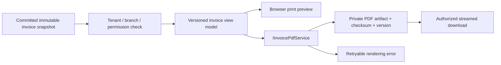

PDF is a derived artifact; snapshot is the source. A failed renderer can retry without new sale/payment/number. Artifact caching keys include tenant, invoice ID and template version. Preserve previously delivered artifact version/hash. File requests authorize each download, use private storage keys outside web root, and never expose a filesystem path. Files upload through size/type limits, magic-byte verification, generated names, hash and quarantine/malware policy; path traversal forbidden. Logo/signature uploads receive the same validation. Retention/deletion must preserve required invoice history and audited access.

## 16. Returns, cancellations and reversals

Completed records stay immutable. Sale cancellation requires reason, permission, legal eligibility and physical assessment. Create a linked correction/credit document where required, append inverse financial postings, release/return stock if actually received, and resolve refunds/customer credit explicitly. Retain original number and document marked cancelled; never reuse it. Draft cancellation simply releases reservations with audit.

Payment reversal is a new opposite-direction transaction linked uniquely to the original. Append inverse ledger entry and allocation reversals in one transaction; reopen affected invoice dues. `IsReversed` is a projection, not deletion. Reallocation is append-only reversal of old allocation plus new allocation, with no additional money movement. A single payment cannot be reversed twice. Partial refund is a new bounded refund against a credit entitlement; it is not a partial overwrite of the original payment.

Returns validate remaining returnable quantity, original sold device and prior returns. Condition determines InStock/Damaged/InRepair; refunds require an actual outgoing payment or recorded customer credit. Return costs restore original unit/layer costs, not current purchase prices. Partial returns issue only the relevant credit amounts. Supplier returns similarly adjust stock/payable and trace supplier credit notes. Replacement means return/credit plus a new sale, preserving both histories. Reject financial cancellation without a supported stock/cash resolution rather than guessing.

Transfers dispatch and receive in separate atomic transactions. Dispatch removes source available stock into InTransit; receipt adds destination stock/cost layers. Partial receipt explicitly tracks remaining units/quantities. A cancel after dispatch uses a compensating return-to-source workflow, not a draft status change.

## 17. Audit, indexes and transaction boundaries

Successful business changes append AuditLog within the same DB transaction as their effects. Customer edits, discounts/price overrides, purchase/sale completion, payment reversal, expense correction, stock adjustments and permission changes require explicit semantic audit actions. A SaveChanges interceptor can capture master changes but cannot substitute for named business audit events. Sensitive commands require reason and optionally approval; snapshots redact passwords/tokens/full bank credentials. Login/logout/denied-access events use separate security logging so failure is visible even when a business transaction rolls back.

Audit is append-only to the runtime role, records actor/tenant/branch/correlation/entity/action/UTC/network and redacted before/after. Appends in the same transaction prove what committed; they are not tamper-proof against the database administrator. Off-host backups and later tamper-evident archive strengthen that boundary. Audit search/export has its own permission and retention policy.

| Index / constraint | Purpose |
|---|---|
| Unique Tenant.Handle; User(TenantId,NormalizedLogin) | Tenant login resolution |
| Unique tenant Id pairs on tenant-owned parents; composite child FKs | Database ownership integrity |
| Unique Branch(TenantId,Code), UserBranch(TenantId,UserId,BranchId) | Branch identity/membership |
| Customer(TenantId,NormalizedPhone), Supplier(TenantId,Name) | Fast party lookup; customer phone is indexed, not assumed unique |
| ProductVariant(TenantId,SKU) unique; active barcode unique | Catalog identity |
| InventoryIdentifier(TenantId,Kind,NormalizedValue) unique | Cross-slot IMEI and identity lookup |
| InventoryIdentifier(TenantId,InventoryUnitId,Kind,Slot) unique | One value per identity slot |
| InventoryUnit(TenantId,BranchId,Status,ProductVariantId); received date | Availability and aging |
| StockBalance(TenantId,BranchId,ProductVariantId) unique | One quantity balance |
| StockCostLayer(TenantId,BranchId,ProductVariantId,ReceivedAtUtc,Id) | FIFO locking/valuation |
| Sale(TenantId,InvoiceNumber) unique when assigned | No reused invoice numbers |
| Invoice(TenantId,Number) unique; sale FK unique for sale invoice | Document identity |
| DocumentSequence(TenantId,BranchId,Type,FY,Series) unique | Serialized counter updates |
| Purchase(TenantId,SupplierId,NormalizedInvoiceNumber,FY) | Supplier reference search; uniqueness policy reviewed |
| Sale/Purchase(TenantId,BranchId,BusinessDate,Id) | Date-filtered reports |
| Ledger(TenantId,PartyId,BranchId,EntryDate,PostingSequence) | Scoped statements |
| Ledger unique(TenantId,SourceType,SourceId,PostingKind) | Exactly-once source posting |
| Payment(TenantId,BranchId,TransactionDate,Id); reversal source unique | Receipts and reversal prevention |
| Allocations(TenantId,SaleId/ PurchaseId), payment FK | Invoice due and payment capacity checks |
| Movement(TenantId,BranchId,ProductVariantId,OccurredAtUtc,Id) | Stock reconciliation |
| Audit(TenantId,CreatedAtUtc,Id), entity reference | Audit lookup |
| Idempotency(TenantId,UserId,Route,Key) unique | Retry safety |
| RefreshToken.Hash unique; family/session indexes | Rotation/revocation |

Avoid redundant TenantId-only indexes when leading composite indexes already serve queries. Add pg_trgm indexes for name contains-search only after query plans justify it. Global search performs bounded indexed server queries across allowed resources, no full table loading. Check constraints enforce positive amounts/quantities, nonnegative balances, valid debit-or-credit exclusive entries, legal method/direction combinations and exactly-one party where required. Cross-row sums need transactional locking, not CHECK constraints pretending to inspect other rows.

| Command | Atomic boundary / concurrency |
|---|---|
| Registration | Tenant, profile, branch, owner, roles, subscription all-or-nothing |
| Complete purchase | Draft lock, sequence, stock, cost, payable, payments, audit, idempotency |
| Complete sale | Draft/customer locks, ordered stock/layer locks, number, snapshot, cost, ledger, payments, audit |
| Receive payment | Customer/supplier and invoice locks, receipt, allocations, ledger, audit |
| Reverse payment | Original/relevant invoice locks, inverse receipt/ledger/allocations, audit |
| Cancellation/return | Original/return capacity locks, correction document, stock/cost/ledger/refund, audit |
| Adjustment / opening stock | Stock locks, cost layers, movements, reason and audit |
| Transfer dispatch / receipt | Each leg atomic; no long transaction while goods physically travel |
| Privilege/branch change | Membership/grants, version bump, last-owner invariant, audit |

Use PostgreSQL READ COMMITTED with explicit row locks/conditional updates for these invariants. Lock stock in deterministic ID order and counters consistently to reduce deadlocks. Retry deadlocks/serialization failures only at the whole idempotent use-case boundary with bounded retries. Credit-limit and unallocated-payment calculations also lock the customer/payment to prevent write skew. Version/If-Match guards reject stale drafts. No network calls/rendering inside DB transactions.

Idempotency required on posting commands: key is scoped to tenant/user/route, request hash prevents different-body reuse, and result commits with effects. Simultaneous same-key requests serialize via the unique record. Store enough document-level uniqueness to prevent duplicated completion after key retention expires; completed draft can return its original result. Number allocation uses row lock/upsert followed by increment in the posting transaction, not MAX + 1. Cancelled numbers remain reserved; do not promise gap-free legal numbering without policy review.

## 18. API catalog

Base: `/api/v1`. JSON contracts are typed and versioned. Authenticated routes always enforce tenant context; branch-scoped routes additionally enforce membership. Permissions below abbreviate section 8 policies. All list routes support allowed filters, sort, `page`, `pageSize` (default 25, max 100), and return `{items,page,pageSize,totalItems,totalPages}`. Stable ordering always ends in ID. Large exports are bounded jobs. P1/P2/P3 indicate delivery phase, not deployed endpoints today.

| Method / route | Function | Policy / phase |
|---|---|---|
| POST `/auth/register` | Business/owner onboarding | Public rate-limited, P1 |
| POST `/auth/login`, `/auth/refresh`, `/auth/logout` | Session lifecycle | Credentials/cookie/session, P1 |
| POST `/auth/forgot-password`, `/auth/reset-password` | Secure account recovery | Public rate-limited token flow, P1 production |
| GET `/auth/me` | Current identity/grants/branches | Authenticated, P1 |
| GET `/business`; PUT `/business` | Profile read/update | Auth / business.settings, P1 |
| GET `/business/onboarding`; POST `/business/onboarding/complete` | Validate setup | business.settings, P1 |
| GET, PUT `/settings` | Tenant/scanner/invoice settings | business.settings, P1 |
| GET, POST `/bank-accounts`; PUT `/bank-accounts/{id}`; POST `/{id}/deactivate` | Private business bank config | business.settings, P1 |
| GET, POST `/branches`; GET, PUT `/branches/{id}`; POST `/{id}/deactivate` | Branch administration | branches.manage for mutation, P1 |
| GET, POST `/users`; GET, PUT `/users/{id}` | Staff and invitation creation | users.manage, P1 |
| POST `/users/{id}/deactivate`; PUT `/users/{id}/branches`, `/users/{id}/roles` | Access management | users.manage, P1 |
| POST `/invitations/accept` | Single-use invite acceptance | Token flow, P1 |
| GET `/permissions`; GET, POST `/roles`; PUT `/roles/{id}`; PUT `/roles/{id}/permissions` | Granular grants | users.manage, P1 |
| GET, POST `/tax-rates`; PUT `/tax-rates/{id}`; POST `/{id}/deactivate` | Configurable taxes | business.settings, P1 |
| GET, PUT `/tax-policy` | Tax mode / regime settings | business.settings, P1 |
| GET, POST `/brands`, `/product-categories` | Catalog masters | inventory.view / inventory.create, P1 |
| PUT `/brands/{id}`, `/product-categories/{id}`; POST `/{id}/deactivate` on each | Archive masters | inventory.create, P1 |
| GET, POST `/products`; GET, PUT `/products/{id}`; POST `/{id}/deactivate` | ProductModel catalog | inventory.view / inventory.create, P1 |
| GET, POST `/products/{id}/variants`; PUT `/variants/{id}`; POST `/variants/{id}/deactivate` | Product variants | inventory.view / inventory.create, P1 |
| GET, POST `/customers`; GET, PUT `/customers/{id}`; POST `/{id}/deactivate` | Master / quick create | customers.view / customers.manage, P1 |
| GET, POST `/customers/{id}/notes` | Attributed follow-up notes | customers.view / customers.manage, P1 |
| GET `/customers/{id}/sales`, `/{id}/payments`, `/{id}/ledger`, `/{id}/outstanding` | Customer detail / LenDen | sales.view / payments.view / customers.credit.view, P1 |
| POST `/customers/{id}/payments` | Receive/allocate receipt | payments.create, P1 |
| GET, POST `/suppliers`; GET, PUT `/suppliers/{id}`; POST `/{id}/deactivate` | Supplier master | supplier.view / supplier.manage, P1 |
| GET `/suppliers/{id}/purchases`, `/{id}/outstanding` | Supplier summary | supplier.view + purchase.view, P1 |
| GET `/suppliers/{id}/ledger`; POST `/{id}/payments` | Detailed ledger / payment | supplier.view P2 UI, payments.create P1 |
| GET `/inventory`, `/inventory/{id}`, `/inventory/{id}/movements` | Units and lifecycle | inventory.view, P1 |
| GET `/inventory/by-imei/{imei}`; POST `/inventory/scan` | Scoped identifier lookup | inventory.view, P1 |
| GET `/inventory/balances`, `/inventory/movements` | Quantity and stock history | inventory.view, P1 |
| POST `/inventory/opening-stock`, `/inventory/adjustments` | Controlled stock posting | inventory.create / inventory.adjust, P1 minimum |
| POST `/inventory/reservations`; DELETE `/inventory/reservations/{id}` | Optional explicit reservation/release | sales.create, P1 if reservations enabled |
| GET, POST `/purchases`; GET, PUT `/purchases/{id}` | Purchase list/draft/header | purchase.view / purchase.create, P1 |
| POST `/purchases/{id}/items`; PUT, DELETE `/purchases/{id}/items/{itemId}` | Draft item changes | purchase.create, P1 |
| POST `/purchases/{id}/items/{itemId}/units`; DELETE `.../units/{captureId}` | Draft IMEI capture | purchase.create, P1 |
| POST `/purchases/{id}/quote`, `/{id}/complete`, `/{id}/cancel-draft` | Totals / post / discard | purchase.create, P1 |
| GET, POST `/sales`; GET, PUT `/sales/{id}` | Sale list/draft/header | sales.view / sales.create, P1 |
| POST `/sales/{id}/items`; PUT, DELETE `/sales/{id}/items/{itemId}` | Draft sale lines | sales.create, discount policy, P1 |
| POST `/sales/{id}/quote`, `/{id}/complete`, `/{id}/cancel-draft` | Totals / atomic billing | sales.create, P1 |
| POST `/sales/{id}/cancel` | Audited financial cancellation | sales.cancel, P1 safe correction |
| GET `/invoices/{id}`, `/{id}/preview`, `/{id}/pdf` | Snapshot / print / download | sales.view + branch, P1 |
| GET `/payments`, `/payments/{id}`; POST `/payments` | Receipts/payments | payments.view / payments.create, P1 |
| GET `/payments/{id}/allocations`; POST `/{id}/allocations` | Allocate available credit | payments.view / payments.create, P1 |
| POST `/payment-allocations/{id}/reverse` | Release incorrect allocation | payments.reverse, P1 |
| POST `/payments/{id}/reverse` | Append payment reversal | payments.reverse, P1 |
| POST `/ledger-adjustments` | Opening/correction entry with reason | ledger.adjust, P1 controlled |
| GET `/lenden/outstanding`, `/lenden/overdue` | Invoice-linked due/aging | customers.credit.view, P1 |
| GET, POST `/expense-categories` | Expense taxonomy | expenses.view / business.settings, P1 |
| GET, POST `/expenses`; GET `/expenses/{id}`; POST `/{id}/reverse` | Expense / immutable correction | expenses.view / create / reverse, P1 |
| GET `/dashboard/summary` | Scoped owner/store summary | scoped metrics, profit.view separately, P1 |
| GET `/reports/sales`, `/reports/purchases`, `/reports/payments`, `/reports/expenses` | Operational reports | reports.view plus underlying access, P1 |
| GET `/reports/profit`, `/reports/outstanding`, `/reports/stock`, `/reports/gst`, `/reports/hsn` | Financial / stock reports | reports.view + relevant sensitive permission, P1 |
| GET `/search?q=...` | Bounded authorized global search | Auth + per-result resource policies, P1 |
| GET `/audit-logs` | Filtered audit | audit.view, P1 |
| POST `/files`; GET `/files/{id}/download`; POST `/files/{id}/links` | Private upload/access/attach | files.upload + target resource access, P1 |
| GET `/subscription`, `/subscription/usage` | Entitlements / usage | subscription.manage, P1 |
| POST `/sales/{id}/returns`; GET `/returns`, `/returns/{id}`; POST `/{id}/complete` | Return draft/assessment/posting | sales.return, P2 |
| GET `/credit-notes/{id}`; POST `/sales/{id}/credit-notes` | Linked corrections | sales.return + ledger.adjust as applicable, P2 |
| POST `/purchases/{id}/returns`; GET `/purchase-returns/{id}`; POST `/{id}/complete` | Supplier return | purchase.create + inventory.adjust, P2 |
| GET, POST `/stock-transfers`; GET `/stock-transfers/{id}`; POST `/{id}/approve`, `/{id}/dispatch`, `/{id}/receive`, `/{id}/cancel` | Transfer state machine | inventory.transfer, both-branch rules, P2 |
| GET `/reports/stock-aging`, `/reports/returns`, `/reports/movements`, `/reports/supplier-ledger` | Advanced reports | reports.view + relevant policies, P2 |
| POST `/device-acquisitions`; GET, POST `/used-device-inspections`; PUT `/used-device-inspections/{id}` | Used-device acquisition/inspection | inventory.create + payments.create where paid, P2 |
| POST `/sales/{id}/exchanges`; GET `/exchanges/{id}` | Traceable trade-in | sales.create + inventory.create, P2 |
| POST `/imports`, `/imports/{id}/validate`, `/imports/{id}/commit`; GET `/imports/{id}/errors` | Reviewed CSV pipeline | resource write policy, P2 |
| POST `/exports`; GET `/exports/{id}`, `/exports/{id}/download` | Private report exports | reports.export + source policy recheck, P2 |
| GET, POST `/repair-jobs`; GET, PUT `/repair-jobs/{id}`; POST `/{id}/transition`, `/{id}/parts`, `/{id}/payments` | Repair workflow | repairs.* defined in P3 |
| GET, POST `/finance-providers`; POST `/sales/{id}/finance`; POST `/finance-sales/{id}/settlements`; GET `/finance-sales/{id}` | Separate lender receivable | finance.* defined in P3 |
| POST `/invoices/{id}/send`; GET `/notification-deliveries/{id}` | Real provider messaging | notifications.send + invoice access, P3 |
| POST `/invoices/{id}/e-invoice`, `/{id}/e-way-bill`; GET `/{id}/provider-status` | Authorized compliance provider | business.settings + invoice policy, later |
| GET `/platform/tenants`; POST `/platform/tenants/{id}/suspend`, `/{id}/activate`; GET `/platform/health`, `/platform/usage` | Control plane | Separate platform policies, later |
| GET `/health/live`, `/health/ready`, `/health` | Liveness/readiness alias | Internal readiness detail, P1 |

No DELETE endpoint for completed financial records. Draft line DELETE and reservation release do not delete historical financial entries. Updates use explicit version/If-Match. Posting endpoints require idempotency keys; UI double-click prevention alone is insufficient. ISO dates/UTC timestamps and decimal strings are documented in OpenAPI. File/PDF responses are streams, exports are asynchronous jobs when large.

## 19. Error model

Expected validation/domain failures use Result and stable error codes; unexpected exceptions map centrally to sanitized ProblemDetails with correlation ID. Do not expose SQL, stack traces or another tenant's record existence. A missing or inaccessible resource generally returns the same 404; branch operation denial on an otherwise visible resource may be 403.

| Status | Examples |
|---|---|
| 400 | Malformed input, validation errors, invalid IMEI format |
| 401 | Missing/expired/revoked authentication |
| 403 | Missing permission, forbidden branch action, subscription mutation blocked |
| 404 | Resource missing or outside authorized tenant scope |
| 409 | Sold/reserved stock, duplicate identifier, stale version, over-allocation, idempotency body mismatch |
| 422 | Valid request shape but unsupported configured tax/compliance workflow |
| 429 | Rate limit / Retry-After |
| 500 / 503 | Sanitized unexpected failure / temporary dependency unavailable |

```json
{
  "type": "urn:invora:problem:inventory-unavailable",
  "title": "Inventory unit unavailable",
  "status": 409,
  "detail": "The selected device is no longer available for sale.",
  "code": "INVENTORY_ALREADY_SOLD",
  "traceId": "request-correlation-id",
  "errors": {}
}
```

Client maps stable codes to actions, preserves drafts on failure and refreshes stale stock. Never imply a payment failed if an HTTP timeout leaves posting uncertain; query idempotent completion status or retry with the same key.

## 20. Security review

| Threat | Control / proof |
|---|---|
| Cross-tenant/branch IDOR | Context, ownership checks, composite FKs, list/detail/file/report/search tests |
| Hidden cost leakage | Server DTO projections and export/PDF/search sensitivity checks |
| Overselling / excess credit allocation | Conditional updates/row locks and two-session race tests |
| Credential/token theft | Identity hashing, HTTPS, short JWTs, secure rotated refresh cookie, no token logs |
| Privilege escalation | Current policies, grant versioning, last-owner protection, audited changes |
| CSRF / XSS | Origin/CSRF checks for cookies, CSP, safe Angular templates, sanitized content, no arbitrary invoice HTML |
| SQL/path injection | Parameterized queries, allowlisted sort/filter, generated private storage keys |
| Malicious attachment | Size/magic-byte validation, quarantine, no executable public serving |
| Financial tampering | Immutable sources/snapshots, linked reversal, append-only runtime permissions, reconciliation |
| Leaked credentials in repository/images | Environment secret injection, image/repo scanning, .env ignored, no build-time production secrets |
| Suspended staff/tenant still active | Current status/version validation on mutations and downloads |
| Backup loss or ransom | Off-host encrypted backups, restricted keys, restoration rehearsals |
| Platform support overreach | Separate control plane, no casual data access, explicit audited elevation |

Use exact-origin CORS, HTTPS/HSTS after TLS verification, restrictive CSP/security headers, trusted proxy configuration, request/file limits and least-privilege database roles. Migration role owns schema; runtime role cannot alter schema or delete/update ledger/audit/movement rows. EF access does not grant administration. Secrets come from environment or mounted restricted files; never seeded demo passwords in production. Structured logs include tenant/branch/user/correlation/request/endpoint/status/elapsed time while excluding financial payloads, tokens and sensitive bank data.

Privacy/retention policy must distinguish contact data from records needed for financial history. Restrict logs/backups and audit exports accordingly. Review actual statutory retention and tax rules with the business's accountant before claiming compliance; this document makes no legal filing or certification claim.

## 21. Testing and acceptance gates

Unit tests cover outstanding/aging, allocation capacity and reversal, tax split/inclusive/discount/rounding reconciliation, landed cost/FIFO, serialized transitions, sale/purchase rules, invoice snapshots/amount words, permission predicates and limits. Use generated edge cases for monetary reconciliation, including one-paise ties, zero-rated items, multi-rate discounts, returns and component rounding.

Integration tests use a real PostgreSQL version matching deployment through Testcontainers; no EF InMemory substitute for database invariants. Test API authorization plus direct constraint failures. Two independent connections coordinate concurrency barriers for double-sale, identifier insertion, payment allocation, credit limit, numbering and transfer receipt races. Inject failure after stock or ledger write and verify full rollback. Verify idempotent same-key/body retries, mismatched-key body rejection and restart after committed timeout.

Mandatory integration matrix: tenant and branch isolation on reads/writes/search/reports/files, forged payload tenant/branch, cross-tenant FK, IMEI1 vs IMEI2 duplicates, partial/full payment, advance, reallocation, reversal, cancellation, returns (Phase 2), purchase completion, FIFO cost restoration, stock transfer (Phase 2), concurrent invoice sequence, audit event atomicity, stale draft rejection, refresh replay/family revocation and suspension enforcement. Reconcile account balance, invoice dues, payment allocations, stock balances/movements and cost layers.

Frontend tests cover typed-form validation, guards/directives, scan queue ordering, manual entry/Enter/Tab, focus/dialog lifecycle, rapid scans, duplicate feedback and uncertain completion recovery. Playwright end-to-end covers owner onboarding → purchase receiving → scan-based sale → partial receipt → later LenDen payment → PDF and ledger, plus a restricted salesperson flow. PDF fixtures cover long names, many units, multi-page HSN table, dual IMEI, no GST, interstate/intrastate, returns, logo absence and amount-in-words boundaries.

Manual scanner guide must test actual USB HID, Bluetooth HID and wireless 2.4 GHz HID; 20+ repeated scans; manual paste/type; Enter and configurable Tab; bad/duplicate IMEI; IMEI2 attachment; no scanner mouse clicks between units; modal interruption; focus after completion; slow network/queue saturation; reconnect and optional sound disabled. Browser synthetic key events do not replace real scanner acceptance.

CI: locked restore, backend build/test, PostgreSQL integration suite, strict Angular build/test, end-to-end critical paths, container build, dependency checks and secrets scan. Every phase documents affected files, adds meaningful tests, runs builds/tests and fixes failures before handoff. No tests/builds were executed for this design-only deliverable because application code does not yet exist.

## 22. Docker, Lightsail and operations

Development Compose initially starts only PostgreSQL for skeleton work, bound to localhost if host API needs access. Full development stack is optional. Production Compose uses `invora-api`, `invora-db`, `invora-nginx`, named PostgreSQL/document volumes, health checks and restart policies. Production database/API have no published ports; only Nginx publishes 80/443. Optional certificate renewal runs through a host timer or small dedicated job, with restricted certificate volumes.

API Dockerfile is multi-stage SDK build/runtime, nonroot runtime, pinned supported images and read-only root filesystem where practical. Frontend builds with pinned Node/Angular dependencies, copies only static output into Nginx. Production secrets are injected at runtime from restricted environment/files, never committed `.env`; .env.example contains placeholders. Configure DB/JWT issuer/audience/signing keys, allowed origins, storage and logging explicitly. Container readiness is useful but does not substitute for application retry behavior.

Lightsail host: patched supported Ubuntu, SSH keys/restricted management access, firewall exposing 80/443 publicly, Nginx routing `/api` and SPA fallback, Let's Encrypt renew/reload tested, optional Cloudflare configured for end-to-end TLS. PostgreSQL stays internal. Development/staging/production use separate databases, secrets and volumes. Production startup never automatically seeds demos or runs unreviewed migrations.

Deployment pipeline builds tagged immutable images, runs tests, takes backup, applies reviewed migrations with a dedicated migration identity/job, then starts application and validates readiness and a business smoke test. Use expand/contract migrations for compatibility. Rollback of code requires compatible schema; restoring a database is a recovery procedure with potential data loss, not an ordinary deploy rollback. No AWS resources or costs are created in this architecture stage.

Backups: proposed daily encrypted pg_dump custom-format plus document archive/manifests outside the Lightsail host, 7 daily/4 weekly/12 monthly retention subject to policy. Pilot recovery targets proposed RPO ≤24h and RTO ≤4h, measured by restore drill. Monitor backup freshness/failure and disk growth. As requirements tighten, add WAL archiving/PITR or managed RDS. Restore into an isolated environment, verify migrations, row counts and financial/stock reconciliation, then document timed recovery. Host snapshots alone are insufficient for the proposed off-host recovery plan.

Monitor readiness/DB latency/error rate, slow queries, disk/volume usage, backup age, renewal expiry and posting failures. `/health/live` has no DB dependency; `/health/ready` checks DB with bounded timeout; public responses expose no credentials/topology. Logs rotate and correlate requests. Measure scan lookup latency and posting p95 with realistic datasets before choosing instance size; “100 tenants” is not itself a capacity calculation.

## 23. MVP milestones in the requested order

Sequence preserves the brief's dependency order. It does not delay security until after UI or audit until after money: each mutation ships with its own authorization/audit, then the audit/reporting interface is completed at its named milestone.

| Gate | Requested steps | Deliverable / exit criteria |
|---|---|---|
| M0: architecture review | 1 | Approve risks/decisions, core relationships, money policies and phased scope; current stopping point |
| M1: skeleton and database | 2–3 | Solution/projects/references, configs, packages, ProblemDetails/Serilog/OpenAPI/health, dev PostgreSQL, DbContext/base entities; restore/build/test pass |
| M2: tenant and access foundation | 4–7 | Tenant/business/branch, registration/login/rotation, tenant and branch isolation, grants; adversarial isolation/auth tests pass |
| M3: tax/catalog/inventory/scanner | 8–11 | Reviewed core model, configured taxes, variants, identifiers/balances/cost layers, reusable HID component; duplicate/race/scanner tests pass |
| M4: purchasing | 12–13 | Suppliers, receiving draft, exact capture counts, atomic stock/payable posting, private supplier bill; rollback/reconciliation tests pass |
| M5: sales and LenDen | 14–17 | Customers, scan-based sale, initial/later payment, allocations/advance/reversal, credit/aging, safe correction; double-sale/payment race tests pass |
| M6: invoices | 18 | Immutable commercial A4/GST/retail snapshots, PDFs and print, licensed renderer, multi-page reviewed fixtures |
| M7: expense/dashboard/audit | 19–21 | Audited expenses, scoped daily metrics, owner cost/profit security, audit interface and financial reconciliation |
| M8: complete Angular workflows | 22 | Consistent responsive navigation and task flows, customer/LenDen screens, scanner keyboard access; full E2E paths |
| M9: integration acceptance | 23 | Consolidate PostgreSQL concurrency/rollback/isolation coverage, real scanner/pilot business acceptance; no unresolved posting defects |
| M10: containers and deployment | 24–25 | Production Compose, staging, restored backup rehearsal, TLS, migration pipeline, approved Lightsail pilot deployment |

The reusable scanner component is implemented at step 11 to validate hardware input early; the integrated Angular application is completed at step 22. Integration tests are added continuously and consolidated at step 23. Review relationships, delete behaviors, uniqueness and indexes before InitialCreate; apply against PostgreSQL and run integration tests immediately. Later modules receive incremental migrations, not speculative tables in InitialCreate.

Phase 1 includes authentication, onboarding, branch/staff/grants, tax/catalog, supplier/purchase/stock/scanner, customer/sale/invoice/PDF/payment/LenDen/ledger, expense/dashboard/audit and minimum safe reversal/cancellation. Phase 2 adds rich supplier ledger, partial returns, transfers, aging, used phones/exchange, advanced reporting, CSV import/export and multi-branch reporting. Phase 3 adds repairs, finance company/down-payment separation, real notifications/WhatsApp, invoice templates, subscription billing and cloud storage. Phase 4 considers analytics/AI/OCR/mobile only after transactions are proven.

Development-only seed is Smart Plaza / Sarangpur Main with specified brands/models, supplier/customer, received devices, one sale and a partial-payment customer. All seed transactions go through the same invariants; use clearly synthetic valid identifiers, no real personal data. Demo seeding is an explicit Development-only action and cannot run in production.

## 24. Architectural review checklist and stop point

Before generating the solution, review:

1. .NET target: keep requested .NET 8 with an immediate migration plan, or adopt recommended .NET 10 LTS.
2. Tenant-bound user login, authorized branches, and shared-database isolation.
3. INR-only MVP, FIFO quantity costing, tax rounding/discount policy and actual tenant GST regime.
4. Canonical identifiers, one-device sale lines, strict capture/no silent identity override.
5. Invoice allocation versus account balance, advances, branch-local collections, opening debt treatment.
6. Phase 1 supplier posting and safe financial correction minimum; Phase 2 partial returns and detailed supplier UI.
7. QuestPDF license, commercial A4 fixture acceptance and missing sample invoice.
8. Pilot recovery/availability targets and staged deployment before real trading.

**Stop here for architectural review, as explicitly requested in the supplied brief.** No solution skeleton, NuGet dependencies, database migration, Docker runtime, AWS resource or application implementation has been generated. After review, the next authorized milestone is M1, followed by the requested restore/build/test verification.
