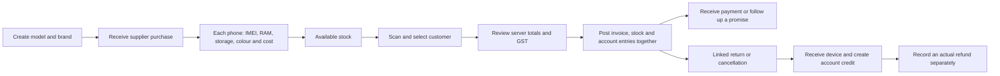

# How Invora works and where your records live

Invora is a browser application for one shop business, with optional branches. It runs on your own PC or a server you control. The owner creates the first login; there is no default password. Trusted employees get their own accounts and only the permissions and branches you grant.

## Daily flow

Receiving a **new supplier bill** creates stock and a supplier payable together. Opening stock is for items already in the shop; it does not invent a supplier bill. Each physical phone has its own identity and variant; quantity accessories use quantity and cost layers. A sale checks that the exact phone is available again when posting. Stock transfers reserve stock at the source; it becomes available at the destination after actual receipt.

The API calculates tax and money totals. A posting transaction either commits its related stock, invoice, payment and ledger records together or rolls them back. An idempotency key prevents an ordinary same-request retry from posting a second transaction. Returns, refunds and reversals retain the original history and add corrections.

## Correcting a device

From **Inventory → Edit device**, correct one phone's colour, RAM/storage, battery health or inspection notes. The same action is available in **Used devices**. Give a clear reason and save; the history shows the operator, time and before/after values. Unknown battery health can stay blank. Only available stock and authorized `inventory.adjust` users can save corrections. The new/used classification stays fixed; a used device may be marked Used, Refurbished or Open box.

IMEI, serial/shop tag, stock quantity, purchase cost and posted bills are protected. The correction applies to this physical device, even when another phone shares its original variant. If the screen reports that the device changed, use **Reload details** and review the latest values. Supplier returns retain the link to the original received device. Use the separate stock, return and transfer workflows for changes in stock or money.

## Warranty shown on invoices

New sales state that applicable warranty is covered by the manufacturer / authorized service partner and the customer must visit the authorized service centre. The shop does not provide that warranty. Used, refurbished and open-box customer devices show **No warranty**. Acquisition/exchange screens no longer offer a store-warranty period. Posted invoices retain the terms and device description captured when issued; subsequent edits do not rewrite them.

## Lena hai or dena hai?

| Account | Lena hai | Dena hai |
|---|---|---|
| Customer sales / invoice account | Customer needs to pay the shop | Shop holds customer credit / owes the customer |
| Independent LenDen | Customer needs to return money given | Shop needs to return money received / held |
| Supplier | Supplier owes the shop or holds its credit | Shop needs to pay the supplier |

The displayed amount is positive, with the direction written beside it. A supplier's negative accounting balance is shown as **Lena hai**, not as a negative payment. Supplier credit can be applied to later purchases or returned as an actual supplier refund; a credit itself is not cash received.

Sales and independent LenDen remain separate. For example, a customer may owe ₹1,000 on an invoice while the shop holds ₹500 in independent LenDen. Both amounts stay visible. Their ₹500 net does not automatically settle either account. The account statement has **Added to dues**, **Reduced dues** and a running **Who owes now?** balance, and can filter the two accounts separately.

A payment promise records a conversation and date; it does not record money. The reminder uses paragraphs, your business name, separate positive dues, the latest promise date and a “Thank you” signature with the shop phone from Business settings. It asks the customer to avoid being recorded as a payment defaulter in the shop records. Add a contact number in Business settings if the reminder shows a missing-number hint. A manually edited draft is preserved when promises refresh; **Use latest promise message** explicitly rebuilds it. Invora does not report customers to banks or credit bureaus. WhatsApp/SMS actions open editable drafts; the operator reviews and sends them. Customer PDF statements can be downloaded or shared from supported browsers.

On **Record payment**, enter the full amount actually received or paid. With **Receive / pay money**, choosing an invoice is optional: leaving the choice empty settles the oldest dues in that branch account automatically. Choosing one invoice applies up to its remaining dues; a smaller payment leaves the difference due and excess stays unallocated on the trading account. **Advance / money on account** keeps the whole payment unallocated. Unallocated money is not automatically refundable credit when other trading dues remain. Refunds still require a real available credit balance, and independent LenDen stays separate. The form previews the split; the server checks current dues again when saving.

Inventory **Export CSV** uses the visible devices/quantity/aging/movement view and its supported filters. Files have dated names, readable column headings, receipt/movement/export dates in the shop time zone, separate identities and specification fields. Costs appear only with cost access. Empty results retain column headings. For Excel imports, choose **Text** for IMEI/serial/SKU columns to preserve long digits and leading zeros; quoting a CSV field alone does not force Excel to treat it as text.

## GST invoices

In Business settings, configure the actual GST registration, GSTIN, registered address, state and bank details. An unregistered shop produces a retail invoice without GST collection; a composition dealer produces a bill of supply. A registered non-composition shop uses its configured product HSN and tax rates.

The sale defaults the place of supply to the customer's state, or the shop state when it is absent. Choose the actual supply/delivery state when different. The API derives CGST + SGST/UTGST versus IGST from that state, rather than requiring a manual inter-state checkbox to agree with the contact record. Contact states are normalized and a provided GSTIN must have a matching state prefix. GSTIN checks validate format and state, not government registration status. The state list follows the [government e-way bill master](https://docs.ewaybillgst.gov.in/apidocs/state-code.html).

New invoices show a dated **shop reference**, for example `INV-SP-MAIN-07Oct26-000001`, and a tax invoice number such as `I-07Oct26-000001`. The tax number is at most 16 characters, with a consecutive business-wide sequence unique within the financial year. Invoice date and issuance time are printed separately. The longer reference remains searchable by itself. This follows the numbering limit in [CBIC Rule 46](https://taxinformation.cbic.gov.in/content-page/explore-rules/1000136/1000001). Existing posted invoice numbers and snapshots are preserved.

The printable invoice shows seller/buyer details, every device identity, net taxable item values, CGST/SGST or IGST rates and amounts, cess when present, amount in Indian words, bank details, declaration and signature area. Identical phones may be combined for printing in small groups while retaining every identity and exact posted amounts. The original per-device sale records stay separate. Credit notes identify their original invoice. PDFs use the free MIT-licensed PDFsharp/MigraDoc library and embedded fonts. Invora currently does not submit GST returns or obtain government IRNs/e-invoice QR codes; the sample's IRN/QR is not fabricated.

See also [Mac installation](macos-installation.md) and [data storage, security boundaries and backup](data-storage-security.md).

## Technology and storage

| Component | What it does | Where data is kept |
|---|---|---|
| Angular 22 UI | Counter forms, lookup, reports and browser navigation | Application assets; business records are requested from the API |
| .NET 10 API | Permissions, validation, GST, stock and money transactions, PDFs | Persistent records in PostgreSQL; temporary in-memory request processing |
| PostgreSQL 18 | Customers, products, identities, invoices, payments, ledger, staff and audit | Docker named volume `invora_database` |
| Private documents | Uploaded supplier bills / expense files | Docker named volume `invora_documents`, mounted at `/var/lib/invora/files` |
| Private configuration | Database password, signing and first-setup secrets | `.env` on the host; not included in Windows or Mac release packages |

The Compose project name is fixed as `invora`, so restarting or rebuilding the containers keeps the same volumes. On Docker Desktop, these volumes are inside its managed Linux storage/VM disk, rather than beside the application source folder. Use Docker Desktop's Volumes view or `docker volume inspect invora_database invora_documents` to identify them. The underlying Windows disk location depends on the Docker backend; see [Docker's backup documentation](https://docs.docker.com/desktop/settings-and-maintenance/backup-and-restore/).

Saving an invoice does not depend on downloading its PDF. The commercial invoice snapshot is stored in the database, and its PDF can be generated again. Uploaded private documents are a separate part of the backup. Closing the browser does not delete records. Removing application images does not delete volumes; deleting Docker volumes or resetting/uninstalling Docker can destroy stored records.

## Security and recovery

- Passwords are hashed. Short-lived access tokens, rotating refresh sessions, CSRF protection, origin checks and login rate limits protect sessions. The API checks permissions and branch access; hiding a UI button is not the security boundary.
- Database constraints and triggers protect posted history and duplicate identities. Audits record changes. Production uses a restricted runtime database role; a privileged database administrator can still modify a database, so audits are not claimed to be administrator-proof.
- Uploaded documents require authorization and are not public static files. Optional old-device Aadhaar references accept only the last four digits.
- The local stack exposes only `127.0.0.1:8080`; database and API ports are not published. Remote/LAN access needs a reviewed HTTPS deployment, rather than exposing the local development stack.
- Normal database/document volumes are not encrypted by the application. Encrypt the host disk and protect recovery keys; Windows supports [Device Encryption / BitLocker](https://support.microsoft.com/en-us/windows/security/encryption/device-encryption-in-windows). A disk administrator or someone with Docker access can access local data.
- The supplied backup script encrypts and signs a database dump plus documents. Schedule off-PC backups, keep decryption/signing keys separately, and rehearse restoration and reconciliation. Merely restarting containers is not a backup. See [deployment and recovery](deployment.md).

No application records are sent to an AI service or automatically messaged to customers. A local installation remains on that PC until you explicitly export, share, back up, or move it to a server.

Use the [Windows installation guide](windows-installation.md) for the shop PC, or [deployment and recovery](deployment.md) for HTTPS server deployment.

Commercial installations use a signed shop licence at **Shop licence**. Send the vendor your Shop ID, not your setup key/password, and paste the issued licence key. Records and exports remain readable after licence expiry. See [licensing and renewal](commercial-release.md).

## Finding dated invoices and taking payment at sale

In **Sales & invoices**, combine the customer/phone/invoice search with **Invoice period**: Today, Yesterday, Last 7 days, This month or Custom dates. From/To include both dates and use the invoice's business date. Leave an endpoint blank for an open range; All dates/Clear dates removes the date restriction. Export CSV respects the current sales search and dates.

In **New sale**, enter the actual cash, UPI and card amounts received; leave unused methods blank or zero. Review shows each method, total received, exchange credit and the remaining due. If you change a payment after review, the balance preview updates and you review once more before completing. Fully paid sales need no credit due date. For part payment, enter a due date; only the unpaid invoice balance appears in LenDen. A separate advance above the new bill should be recorded through Record payment.
